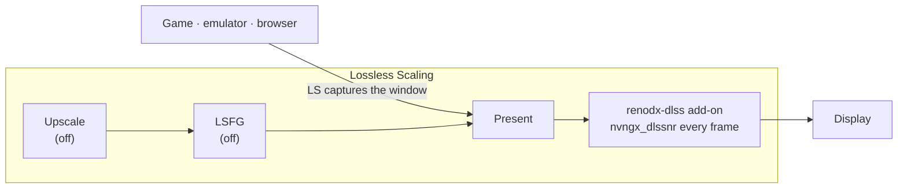

<p align="center">
  
</p>

<h1 align="center">LosslessScaling-DLSS5-Preset</h1>

<p align="center"><strong>A working DLSS 5 Neural Rendering setup for Lossless Scaling, preconfigured and one click away.</strong></p>

<p align="center">
  Everything that has to line up — the proxy, the ReShade add-on, the runtime DLLs and the<br>
  exact INI keys — already set the way it has to be. Download, extract, double-click one file.<br>
  No game files are touched. Uninstall puts the folder back exactly as it was.
</p>

<p align="center">
  <a href="LICENSE"></a>
  <a href="https://github.com/SenjuWoo/LosslessScaling-DLSS5-Preset/releases/latest"></a>
  
  
  
</p>

<p align="center">
  <a href="#quick-start">Quick start</a> ·
  <a href="#what-is-in-the-box">What's in the box</a> ·
  <a href="#lossless-scaling-settings">LS settings</a> ·
  <a href="#tuning">Tuning</a> ·
  <a href="#troubleshooting">Troubleshooting</a> ·
  <a href="#uninstall">Uninstall</a> ·
  <a href="#credits">Credits</a>
</p>

---

Lossless Scaling captures any window — a game, an emulator, a browser — and owns the last stop
before the display. That is a convenient place to hook a neural renderer. This repo is that hook,
already wired: a **LosslessProxy** `Lossless.dll`, **ReShade 6.8.0** with full add-on support as
`dxgi.dll`, the **RenoDX DLSS** add-on, the NVIDIA runtimes they load, and the `ReShade.ini` keys
the add-on needs to fire without the host having native DLSS.

| | |
| --- | --- |
| **Tested on** | RTX 4080 SUPER · driver 616.92 · Lossless Scaling 3.2.2 · Windows 11 |
| **Works on** | NVIDIA RTX 20 / 30 / 40 / 50 (see [GPU notes](#which-gpus-work)) |
| **Needs** | [Lossless Scaling](https://store.steampowered.com/app/993090/) on Steam · ~290 MB free in the LS folder |
| **Touches** | The Lossless Scaling folder. Nothing else. No game files, ever |
| **Reversible** | Yes — `UNINSTALL.bat` restores from backups it made itself |

---

## Quick start

**1. Download the repo** — green **Code** button → *Download ZIP*, then extract it anywhere
(`C:\Users\you\Downloads\LosslessScaling-DLSS5-Preset` is fine).

**2. Double-click `INSTALL.bat`.** Approve the Windows prompt. That is the whole install.

The installer finds your Lossless Scaling folder by itself, backs up what it replaces, copies the
preset in, downloads the NVIDIA runtime archive (~275 MB, it prints the SHA256), writes the
Neural Rendering keys, verifies every file, and offers to start Lossless Scaling for you.

```
[ ok ] Lossless Scaling: S:\SteamLibrary\steamapps\common\Lossless Scaling
[new ] dxgi.dll
[repl] ReShade.ini
[ ok ] DirectNeuralRendering* written (HookMethod=2, HookPoint=1, RequireDlss=0)
...
All checks passed. Start Lossless Scaling with LAUNCH-LosslessScaling.bat.
```

**3. Start the game window you want processed, then press `Ctrl+Alt+S` in Lossless Scaling.**
The picture changes. That is Neural Rendering running.

> **Always start Lossless Scaling with `LAUNCH-LosslessScaling.bat`, not Steam.** LS's own window is
> WPF, which draws through Direct3D — started normally, the add-on processes the settings window too
> and LS can crash on launch. The launcher flips one registry key while LS runs and restores it when
> LS closes. [Why](#the-hw-acceleration-key)

<details>
<summary><strong>Prefer to do it by hand? (drag and drop)</strong></summary>

The `payload\` folder is the drop-in set. Copy its contents into your Lossless Scaling folder,
merging folders when asked:

| From | To |
| --- | --- |
| `payload\dxgi.dll` | `Lossless Scaling\dxgi.dll` |
| `payload\renodx-dlss.addon64` | `Lossless Scaling\renodx-dlss.addon64` |
| `payload\ReShade.ini` | `Lossless Scaling\ReShade.ini` |
| `payload\addons\LSP-Windowed\` | `Lossless Scaling\addons\LSP-Windowed\` |

Then, before copying `payload\Lossless.dll` in, **rename the existing `Lossless.dll` to
`Lossless_original.dll`** — that is the stock file the proxy replaces.

Finally grab the runtime archive from [releases](https://github.com/SenjuWoo/LosslessScaling-DLSS5-Preset/releases/latest)
and extract it straight into the LS folder, and run `INSTALL.bat -Verify` to confirm. Doing it by
hand means you get no backups and no manifest, so `UNINSTALL.bat` will not be able to help you.

</details>

---

## What is in the box

| Component | Version | Goes to | What it does |
| --- | --- | --- | --- |
| `dxgi.dll` | ReShade **6.8.0.2155** | LS folder | Loads ReShade with full add-on support into `LosslessScaling.exe` |
| `renodx-dlss.addon64` | RenoDX DLSS, build **2026-09-17** | LS folder | Runs the neural renderer on every frame LS presents |
| `Lossless.dll` | LosslessProxy **v0.3.0** (MIT) | LS folder | Unofficial add-on manager; also what lets LS capture *windows*, not just fullscreen |
| `addons\LSP-Windowed\` | LSP-Windowed **v0.3.0** (MIT) | LS `addons\` | Windowed-mode capture: browsers, emulators, mobile-game players |
| `ReShade.ini` | preconfigured | LS folder | The `[RENODX-DLSS]` keys that make NR work without native DLSS |
| `nvngx_dlss.dll` `nvngx_dlssd.dll` `nvngx_dlssg.dll` | DLSS **310.9.1.0** | LS folder | Super Resolution, Ray Reconstruction, Frame Generation runtimes |
| `nvngx_dlssnr.dll` | NR runtime **310.8.SF.0** | LS folder | The neural-rendering model itself — the `SF` build is the one that works on RTX 20/30/40 |
| `sl.*.dll` (11 files) | Streamline **2.14.1.0** | LS folder | The layer the NR path goes through |

The four `nvngx_*` DLLs and the Streamline set are **~275 MB**, over GitHub's 100 MB file limit, so
they live in the release archive instead of git. `INSTALL.bat` fetches and unpacks them for you.
[`payload\nvngx\README.md`](payload/nvngx/README.md) has the details and the hashes.

### What actually runs



LS has only the finished colour image — no motion vectors, no depth — so the add-on runs in
*Present* mode, once per frame, at output resolution. Still scenes look best; fast motion can
flicker. That is the trade for it working on literally anything on screen.

**Frame generation and scaling stay off** in LS. NR runs on every frame LS outputs, so generated
frames would multiply the neural work instead of adding cheap frames — and with NR in the present
path they can come out visibly warped.

---

## Lossless Scaling settings

Set these once in LS and leave them. **Scaling** and **Frame Generation** both **Off** is correct
and intentional: here LS only captures and presents.

| Section | Setting | Value |
| --- | --- | --- |
| Frame Generation | Type | **Off** |
| Scaling | Type | **Off** — turn it on only if you also want LS to upscale |
| Capture | API | **WGC** |
| Capture | Queue target | **1** |
| Rendering | Sync mode | Default |
| Rendering | Max frame latency | 3 |
| Rendering | HDR support | On if you play in HDR |
| Rendering | G-Sync | On |
| Rendering | Draw FPS | Off |
| GPU & Display | Preferred GPU | Auto, or your NVIDIA card on a multi-GPU box |
| GPU & Display | Output display | The monitor and resolution you actually play on |

---

## Tuning

The one dial that matters is **Scale** — the resolution the model runs at, as a percentage of the
frame. Lower is faster. Everything else is taste.

| Setting | Where | Notes |
| --- | --- | --- |
| **Scale** | `ReShade.ini` → `DirectNeuralRenderingProcessingScale` | 100 = original resolution. 75 is a good starting point on a 4080-class card; go lower for more FPS |
| **Passes** | `DirectNeuralRenderingPassCount` | 1. Two passes cost twice and rarely look twice as good |
| **Style** | `DirectNeuralRenderingStyle` | `2` = Cinematic (shipped default), `1` = Natural, `0` = Default |
| FPS counter | `ReShade.ini` → `[OVERLAY] ShowFPS` | `2` as shipped. Set `0` to hide it |
| Overlay | `Home` key | ReShade's own overlay, for effects and screenshots |

Rough cost: about **20 ms per pass at 4K** on an RTX 5070 Ti. 4K is roughly four times 1080p, and
cost scales with output resolution, so **Scale** and output resolution are your two levers.

Edit `ReShade.ini` in the LS folder, or turn NR off entirely by setting `DirectNeuralRenderingStyle`
aside and just not pressing `Ctrl+Alt+S`.

---

## Troubleshooting

| Symptom | Fix |
| --- | --- |
| `Ctrl+Alt+S` does nothing | Wait. The add-on needs a few seconds after the first scale. If the first scale takes a minute or more, the driver is asking NVIDIA's servers for models — it caches after the first time |
| Scaling works, no visible NR | Run `INSTALL.bat -Verify`. Line 1 of `ReShade.log` must say *loaded from … dxgi.dll* |
| `ReShade.log` line 1 says *Reshade64.asi* | Something installed ReShade behind an ASI loader, which in LS only fires at exit. Reinstall ReShade as `dxgi.dll` over the LS folder |
| LS crashes on start, or the LS *window* gets processed | LS was started without the launcher. Start it with `LAUNCH-LosslessScaling.bat` |
| The installer says it cannot find Lossless Scaling | `INSTALL.bat -LsPath "X:\your\path\Lossless Scaling"` |
| PowerShell says *running scripts is disabled* | You ran a `.ps1` directly. Use the `.bat` files — they pass `-ExecutionPolicy Bypass` for you |
| Low FPS | Lower **Scale**, then lower the output resolution in LS |
| Everything looks frozen after stopping scaling | Known issue in the add-on's teardown — see [Limitations](#limitations). Scale once per session, keep the game in front, quit the game before closing LS |

Logs worth reading, all in the LS folder: `ReShade.log`, `LosslessProxy.log`, `ShaderHook.log`.

---

## Verify, update, uninstall

```powershell
.\INSTALL.bat -Verify     # check an existing install, change nothing
.\INSTALL.bat             # safe to re-run: idempotent, keeps the original backups
.\UNINSTALL.bat           # put every original file back
.\UNINSTALL.bat -Purge    # ...and also delete the runtime DLLs
```

`INSTALL.bat` is safe to run again at any time. It keeps the *first* backup it ever made, so
re-running never overwrites the stock files it is protecting. `UNINSTALL.bat` walks the manifest it
wrote and reverses it file by file, then deletes the runtime logs.

Want the whole thing gone with no trace? Uninstall, then delete the repo folder.

---

## Which GPUs work

| GPU | Notes |
| --- | --- |
| **RTX 50** | Supported by NVIDIA directly. Swap `payload\nvngx\nvngx_dlssnr.dll` for NVIDIA's own build before installing if you prefer |
| **RTX 20 / 30 / 40** | Run the community-patched NR runtime shipped here (`310.8.SF.0`). A new NVIDIA driver can break it until the patch catches up |
| **AMD / Intel** | The community has it working; not tested in this repo. Needs a different NR runtime — this preset ships the NVIDIA one |

---

## Limitations

- **No motion vectors or depth.** The add-on sees a finished image, so fast motion flickers and
  shimmers. Static or slow scenes are where this shines.
- **Everything on screen is processed** — HUD, subtitles, menus included.
- **Cost scales with output resolution.** Expect roughly 50–60 % of your FPS, per NVIDIA's own
  numbers for the native integration.
- **Single-player only.** Anti-cheat games have their own rules about injected DLLs, and this
  injects several. Do not use it online.
- **A freeze is possible when scaling stops.** Unscaling or LS losing focus destroys the swapchain
  while the add-on still holds GPU resources. Outcomes range from LS closing to a GPU fault needing
  a hard reset. The fault is in the add-on's teardown, not in this preset. Avoid it: scale once for
  the session, keep the game in front, quit the game before closing LS.
- **The add-on and the NR runtime are community builds**, distributed outside GitHub, and they
  change often. This repo pins the versions that were tested together.

---

## Credits

This repo is packaging, not engineering. All of the hard parts belong to other people — if you are
going to star anything, star them.

- **[ReShade](https://reshade.me)** · crosire — the add-on host
- **[RenoDX](https://github.com/clshortfuse/renodx)** · ShortFuse — the `renodx-dlss` DLSS add-on
- **[LosslessProxy](https://github.com/FrankBarretta/LosslessProxy)** and **[LSP-Windowed](https://github.com/FrankBarretta/LSP-Windowed)** · FrankBarretta (MIT) — windowed capture and the add-on manager
- **[RHI](https://github.com/RankFTW/RHI)** · RankFTW — the installer most people use to get here
- **[Lossless Scaling](https://store.steampowered.com/app/993090/)** · THS — the capture and present layer
- **NVIDIA** — DLSS, Streamline and the neural-rendering runtime
- **[dlss5-anywhere](https://github.com/Won-Cafe/dlss5-anywhere)** · Won-Cafe — the clearest write-up of how all of this fits together, and the source of the settings and gotchas documented here

## Legal

- Third-party binaries keep their authors' licences: ReShade belongs to crosire, RenoDX to ShortFuse,
  LosslessProxy and LSP-Windowed to FrankBarretta (MIT), DLSS/Streamline and the NR runtime to
  NVIDIA, Lossless Scaling to THS. The scripts, configs and documentation in this repo are MIT —
  see [LICENSE](LICENSE) and [CREDITS.md](CREDITS.md).
- Not affiliated with, endorsed by, or supported by any of them.
- FrankBarretta notes that the proxy and windowed add-on may conflict with the Lossless Scaling
  terms of service. That is your call to make.
- Anti-cheat: single-player use only.
- Use at your own risk, no warranty.
